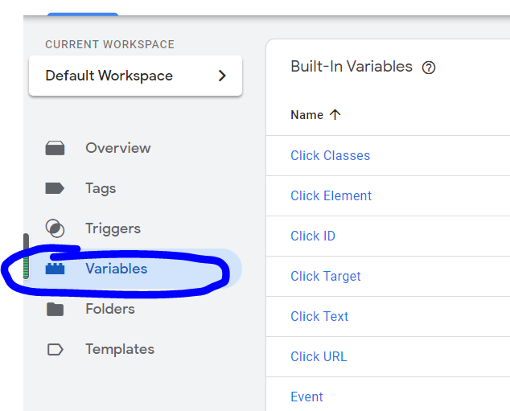
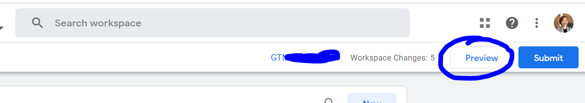
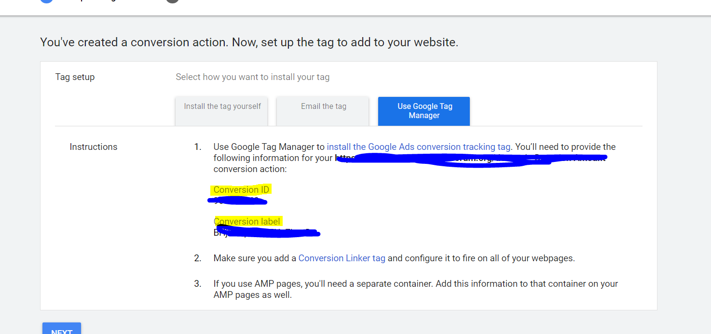

# payment_tracking_instructions
A tutorial put up by Caiwei

# HTML & JS
## Implementation of Google Tag Manager inside html
make sure you have the google tag manager code set up inside your head tag and body tag. 

### Inside Head Tag
<!-- Google Tag Manager -->
```html
<script>(function(w,d,s,l,i){w[l]=w[l]||[];w[l].push({'gtm.start':
new Date().getTime(),event:'gtm.js'});var f=d.getElementsByTagName(s)[0],
j=d.createElement(s),dl=l!='dataLayer'?'&l='+l:'';j.async=true;j.src=
'https://www.googletagmanager.com/gtm.js?id='+i+dl;f.parentNode.insertBefore(j,f);
})(window,document,'script','dataLayer','GTM-XXXXXX');</script>
<!-- End Google Tag Manager -->
```
### Inside Body Tag (as high as possible)
```html
<!-- Google Tag Manager (noscript) -->
<noscript><iframe src="https://www.googletagmanager.com/ns.html?id=GTM-KMFQDMG"
height="0" width="0" style="display:none;visibility:hidden"></iframe></noscript>
<!-- End Google Tag Manager (noscript) -->
```
## HTML For Payment Example
1. We will create a input field (dropdown, number box, checkbox all ok), as long as the id of the element that contains the value is "amount". 
2. Then we will create a button that will trigger a function onclick. This function is called submitEvent(). 
3. Inside the function, I added some console calls to test out whether it is working. 
4. We will use the `window.dataLayer` to push event, and other variables to google tag manager. 
5. record your event name (e.g. `registrationComplete` in this case)
6. record the donation amount, and save it as a number instead of a string. (`Number(variable_name)`). Call this variable `donationAmount`
7. Name the `action` variable `donation`
The output will look something like this

```html
<script> 
function submitEvent(){
console.log("cool")
var amount = document.getElementById('amount').value;
console.log(amount);
  window.dataLayer = window.dataLayer || [];
 window.dataLayer.push({
 'event': 'registrationComplete',
'donationAmount':Number(amount),
 'action': 'donation'
 });
console.log(window.dataLayer)
}
</script>
  <label for="amount">Dollar Amount:</label>
  <input type="number" min="0" id="amount" name="amount"><br><br>
  <button id = "payButton" onclick=submitEvent()>Make Payment</button>
```

# Google Tag Manager

## Setting up custom event trigger
On the left hand side, sekect `triggers`.
Then you will see a list of triggers in this container. Click on the `New` button on the top right side

### Adding a new trigger
- Name of the trigger: Custom - donationComplete
- triggerType: in the drop down menu, select `custom event`
- event name: remember the event name we had in the javascript code. (the string after `event:`). Put down `donationComplete`


## Setting up variables
We have two variables we want to record: donationAmount and action. 
We will create one variable in Google Tag Manager for each. 

Switch to variables tab. 

Scroll all the way to bottom, where you will see User-Defined Variables section.  


### Creating donationAmount variable


- variable name: `dlv - donationAmount`
- variable type: in the drop down menu, select `data layer variable`
- variable name: remember the key we had in the javascript code? Put in `donationAmount`

### Creating actionType variable


- variable name: `dlv - actionType`
- variable type: in the drop down menu, select `data layer variable`
- variable name: remember the key we had in the javascript code? Put in `action`

## Setting Up Tags


### Google Analytics Tags
Switch to  Tag tab. Click on the `new` button on the upper right corner. 


- name this tag `GA Event - donationComplete`
- in the tag type, select Google Analytics Universal Tracking
- Track type: event
- category: Put `donation Complete` we will need this exact string later
- Label: put the client's name.
- Action, click on the little Lego symbol, and select dlv - actionType
- Value, click on the little lego symbol, and select dlv - donationAmount. 
- Analytics Setting, select `Google Analytics Settings` (if already set up). If there are no existing Google Analytics Setting, select create new variable
- In the bottom triggering section, select the trigger we just created. 


<h4> If need to create new Google Analytics Settings... </h4>
  

- Name: Google Analytics Setting 

- PropertyID: the property ID of your google analytics account, looks something like this `UA-xxxxxxxx-1`

- Cookie Domain: `auto`

### Checking If it works in Analytics
1. Preview

Click on the preview on the upper right corner.
2. Enter your website address (with the html & js code implemented)


3. Test it out by clicking on the button with a random donation amount


4. Go to Google Analytics
5. Create a new Goal (Settings -> Admin -> View -> Goals). Set category equals to `donation Complete`. This is the same as whatever we entered in the `GA - donationComplete` tag.

If it is already created, then you don't need to create it. 

6. Go to realtime -> events, you will see your event with action name, and label. You don't see the value, don't worry!

Now you now the tags are connected to your google analytics account
7. Go to Behavior -> Events -> Overview, you will see all the events under this google analytics account. 
- Make sure you have the date set to today's date. 
- If you don't see anything show up, but you see it in realtime tab, just give it more time. This behavior tab is slower than realtimes. 

Once you see it, Click on the `donation Complete` or whatever your category is. 
8. Now you see the value associated with the event. 


# Google Ads Set up

Before we begin creating another Tag... we will have to create conversion tracking first inside Google Ads


1. Make sure you already have the donation compaign associated with the AdWords Account. Go to Tools -> Conversions
2. Create new conversion tracking, select `Website`

3. For the action category, select Purchase. For the conversion name, put in the landing page url first, then put Donation Amount

Use different values for each conversion

Click continue/save
4. Select `Use Google Tag Manager`, you will receive ConversionID and ConversionLabel. We will need this to create tags. 


## Setting up google tag manager Google Ads tag
1. Go back to Google Tag Manager, create a new tag, with the following details: 

2. Use the same conversionID and label we just got from Google Ads. 
3. For the conversionValue, select from the dropdown, `dlv - donationAmount`.
4. For the triggering section, select again the trigger we created. 

## Go Back to Google Ads to finish conversion setting
1. Select the donation campaigns from all the campaigns on the left hand side
2. Click Settings, and find Conversions. If you can't find it, click the Addtional Settings
3. In the Conversions box, select the second checkbox


4. select the conversion we just created and click save. 


You are all Done!!!
